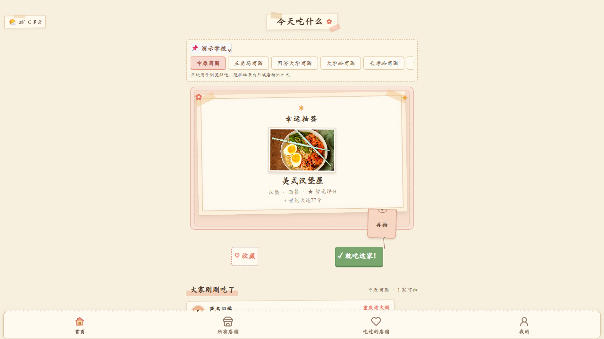
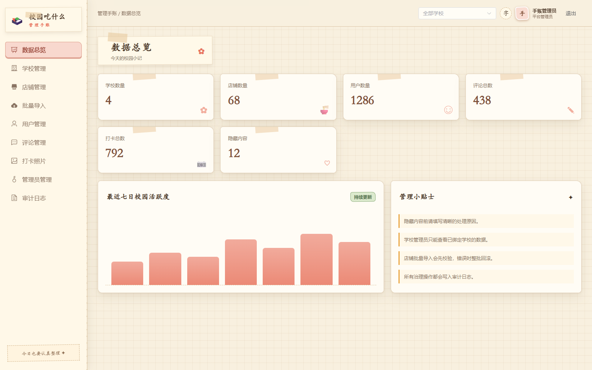
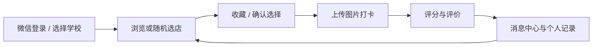
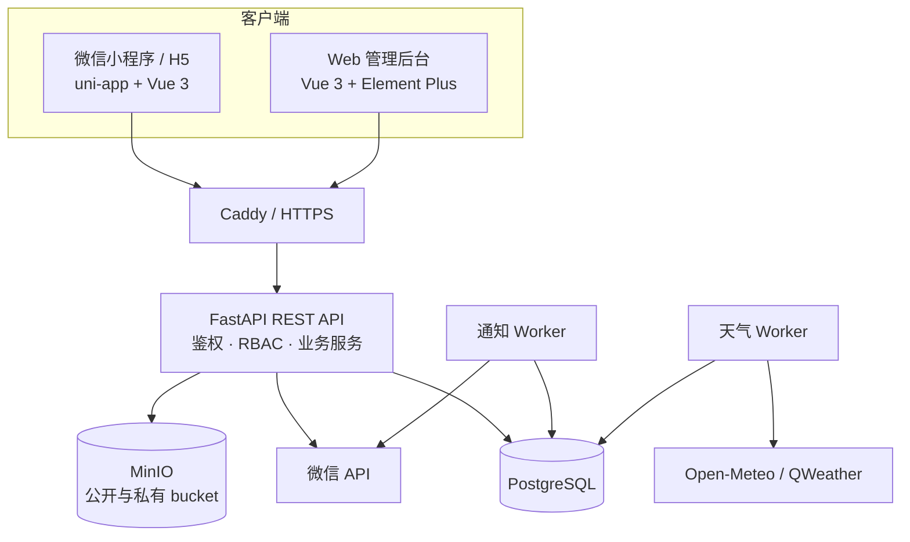

# 今天吃什么（EatAnything）

[](https://github.com/LikX-1019/EatAnything/actions/workflows/ci.yml)

[线上管理后台](https://eat.unilinkcore.cn/admin/) · [API 健康状态](https://eat.unilinkcore.cn/health/ready)

面向校园餐饮场景的全栈决策与运营平台。项目以“今天吃什么”为入口，串联选店、收藏、图片打卡、评价、消息通知和个人记录，并为平台与学校提供独立的 Web 管理后台。

这不是只有一个随机按钮的前端原型：用户、学校、店铺、媒体和互动数据均由后端持久化，权限、内容治理、异步任务、备份恢复和生产部署也形成了完整闭环。

## 项目亮点

- **完整业务闭环**：微信登录后可按学校和校区浏览或随机选店，完成图片打卡后继续评价，并在个人中心回看收藏、打卡、评价和选择历史。
- **多学校数据隔离**：平台管理员可管理全局资源，学校管理员只能访问被授权学校；用户、店铺、评论、打卡照片、消息和审计记录均在后端按学校过滤。
- **可解释的业务约束**：评价必须建立在真实打卡之上；随机结果支持排除当前店铺；收藏、状态切换和通知投递按幂等思路设计。
- **内容与媒体安全**：用户上传内容进入 MinIO 私有 bucket，经鉴权接口读取；店铺公开图片与用户私有媒体分桶管理；评论和照片支持可恢复的软隐藏。
- **面向生产的工程化**：包含 Alembic 增量迁移、Docker Compose 编排、Caddy HTTPS、健康检查、配置预检、备份恢复、冒烟测试和 GitHub Actions 质量门禁。
- **异步与缓存设计**：通知 Worker 负责微信订阅消息的幂等投递、重试与失败记录；天气 Worker 按学校维护缓存；随机店铺候选池按学校隔离并支持主动失效。

## 界面预览

| 用户端首页 | 管理后台数据总览 |
| --- | --- |
|  |  |

> 线上管理后台仅开放登录页面，不在公开仓库中提供管理员账号或密码。用户端同时支持微信小程序与 H5，截图使用演示数据。

## 核心业务流程



## 系统架构



## 功能矩阵

| 角色或模块 | 主要能力 |
| --- | --- |
| 用户端 | 微信登录、首次资料引导、学校与校区切换、天气、店铺搜索、随机选店、收藏、图片打卡、评价、历史、消息中心、个人资料 |
| 学校管理员 | 管理授权学校的店铺、用户、评论、打卡照片和学校范围消息，处理内容治理与用户限制 |
| 平台管理员 | 管理全部学校和管理员账号，分配学校权限，发布平台或定向消息，查看跨学校数据与审计日志 |
| 运营与部署 | CSV/XLSX 原子批量导入、数据库迁移、配置预检、健康检查、备份恢复、生产冒烟测试、HTTPS 自动续期 |

## 关键设计

| 问题 | 实现方式 | 设计价值 |
| --- | --- | --- |
| 随机选店在高频请求下重复查库 | 服务层维护按学校划分的候选池缓存，店铺变化时主动失效 | 降低热路径查询成本，避免跨学校数据混用 |
| 学校管理员不能依赖前端筛选隔离数据 | Token 身份、角色和授权学校在后端统一校验 | 即使绕过管理端界面，也无法越权访问其他学校 |
| 用户媒体不能直接公开 | MinIO 公私分桶，私有对象通过鉴权接口读取 | 避免打卡照片因对象 URL 泄露而公开 |
| 内容治理需要保留证据 | 评论与照片软隐藏，治理操作写入不可编辑审计日志 | 兼顾恢复、追责和历史完整性 |
| 微信消息发送不应阻塞请求 | PostgreSQL 保存投递状态，独立 Worker 异步处理、重试并记录永久失败 | 提升接口稳定性并避免重复通知 |
| 数据库首次安装与持续升级并存 | baseline SQL 初始化新库，Alembic 固定 revision 后继续增量迁移 | 兼顾快速部署和版本可追踪性 |

## 技术栈

| 层级 | 技术 |
| --- | --- |
| 用户端 | uni-app、Vue 3、TypeScript、Pinia、Vite |
| 管理后台 | Vue 3、TypeScript、Pinia、Vue Router、Element Plus、Tiptap |
| 后端 | Python 3.12、FastAPI、SQLAlchemy 2、Pydantic、Alembic |
| 数据与存储 | PostgreSQL 16、MinIO |
| 外部集成 | 微信登录与订阅消息、Open-Meteo、QWeather |
| 工程化 | Pytest、Ruff、Node Test Runner、vue-tsc、Docker Compose、Caddy、GitHub Actions |

## 仓库结构

```text
EatAnything/
├─ frontend/          # 微信小程序与 H5 用户端
├─ admin-web/         # 独立桌面 Web 管理后台
├─ backend/           # FastAPI、业务服务、Worker、迁移与测试
├─ deploy/            # Docker Compose、Caddy、部署与灾备脚本
├─ docs/              # 配置、操作、发布、导入规范与 OpenAPI 契约
├─ .github/workflows/ # 持续集成
└─ README.md
```

## 本地开发

环境要求：Python 3.12、Node.js 22、npm、PostgreSQL 16 和 MinIO。真实密钥只写入被 Git 忽略的根目录 `.env`。

### 1. 启动后端

```powershell
Copy-Item .env.example .env
# 本地联调时将 .env 中的 DEV_AUTH_ENABLED 改为 true
$env:PYTHONPATH=(Resolve-Path 'backend').Path
python -m pip install -e "backend[dev]"
alembic -c backend\alembic.ini upgrade head
python backend\scripts\create_admin.py admin --role platform_admin --display-name "本地管理员"
backend\scripts\run_local.ps1 -Reload
```

API 默认地址为 `http://127.0.0.1:8000`，Swagger 文档位于 `http://127.0.0.1:8000/docs`。

### 2. 启动管理后台

```powershell
Set-Location admin-web
Copy-Item .env.example .env.development
npm ci
npm run dev
```

管理后台默认访问 `http://127.0.0.1:5174/admin/`。

### 3. 启动用户端

```powershell
Set-Location frontend
Copy-Item .env.example .env.local
npm ci
npm run dev:mp-weixin
# 或在浏览器中运行
npm run dev:h5
```

`.env.local` 中的本地 API 地址会覆盖仓库内的远程联调配置。微信小程序构建结果位于 `frontend/dist/dev/mp-weixin`，可导入微信开发者工具。环境配置和开发登录方式见 [用户端开发说明](frontend/README.md)。

## 质量保证

```powershell
# 后端
$env:PYTHONPATH=(Resolve-Path 'backend').Path
python -m compileall -q backend\app
pytest backend\tests -q
Push-Location backend
ruff check app tests
Pop-Location

# 管理后台
Push-Location admin-web
npm ci
npm run build
Pop-Location

# 用户端
Push-Location frontend
npm ci
npm run type-check
npm test
npm run build:mp-weixin
npm run build:h5
npm run verify:production
Pop-Location
```

CI 会重复执行后端编译、静态检查与测试，两个前端的类型检查和生产构建，Docker 镜像构建、Compose 解析、Shell 语法检查以及敏感文件检查。

## 生产部署

生产环境使用独立的 `deploy/.env`，不要复用本地开发配置：

```bash
cp deploy/.env.example deploy/.env
chmod 600 deploy/.env
# 填写真实 Secret、微信配置、域名和唯一的 Compose 资源名称
DRY_RUN=1 ./deploy/scripts/deploy.sh
./deploy/scripts/deploy.sh
./deploy/scripts/smoke-test.sh https://你的域名
```

部署脚本会依次处理配置预检、镜像构建、数据库迁移、服务就绪检查和可选的 Caddy HTTPS。升级前应先完成 PostgreSQL 与 MinIO 备份；普通升级禁止执行 `docker compose down -v`，避免删除数据库和媒体数据卷。

## 文档导航

- [环境变量与配置说明](docs/configuration.md)
- [Web 管理后台使用手册](docs/admin-guide.md)
- [生产部署说明](deploy/README.md)
- [生产发布检查清单](docs/release-checklist.md)
- [后端本地开发说明](backend/README.md)
- [Web 管理后台开发说明](admin-web/README.md)
- [用户端开发说明](frontend/README.md)
- [店铺批量导入规范](docs/store-import-spec.md)
- [OpenAPI 契约](docs/openapi-v1.yaml)
- [安全策略](SECURITY.md)
- [变更记录](CHANGELOG.md)

## 项目边界

项目聚焦校园餐饮决策和内容运营，不包含菜品交易、购物车、支付、退款或履约能力。当前位置、距离排序、个性化推荐和社交关系也不在当前范围内；这些能力需要额外的隐私授权、数据规模与推荐效果评估，不能仅靠增加页面入口完成。
