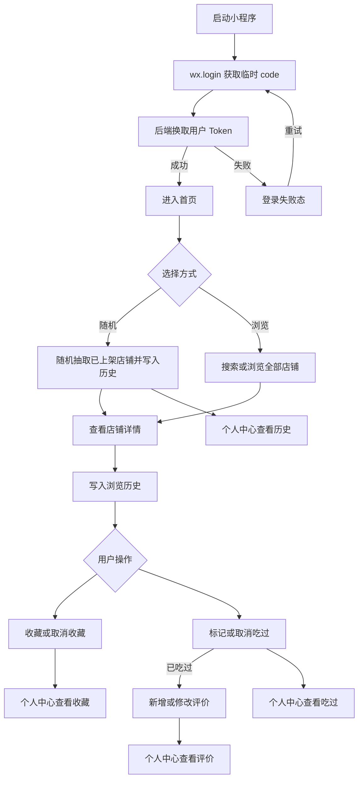
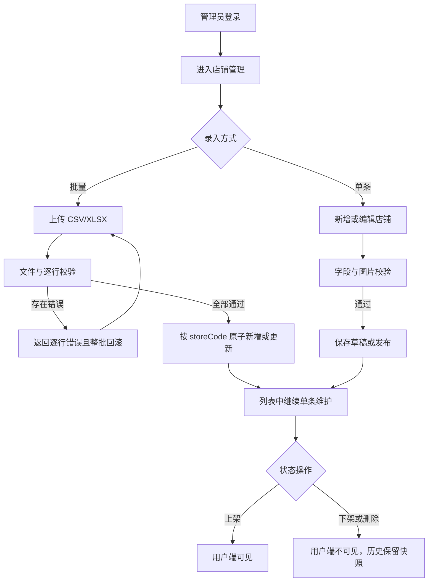

# “今天吃什么”第一阶段需求与接口梳理

## 1. 文档目的

本阶段将现有 uni-app 前端演示整理为可进入研发的 MVP 需求和接口契约，不实现前端页面、后端服务或数据库。

当前代码包含用户端首页、全部店铺、店铺详情、吃过的店铺、我的、收藏、评价、历史记录和管理端 H5 页面；业务数据通过 FastAPI、PostgreSQL 和 MinIO 持久化。首页不再展示伪造动态，用户打卡媒体使用私有 bucket。

产品定位为餐饮决策助手，核心价值是帮助用户快速选店并管理收藏、吃过、评价和历史数据，不包含菜品、购物车、订单、支付或履约能力。

## 2. 角色与权限

| 角色 | 身份方式 | 权限 |
| --- | --- | --- |
| 微信用户 | 小程序 `wx.login` 获取 code，后端换取 Bearer Token | 浏览已上架店铺、随机选店、维护个人收藏/吃过/评价、查看个人历史与统计 |
| 管理员 | 独立账号密码登录，后端签发包含管理员角色的 Bearer Token | 查询全部店铺、单条新增/编辑/上下架/删除、上传图片、批量导入 |

不提供游客模式。用户登录失败时停留在登录失败态，可重新发起微信静默登录，不能进入主业务页面。

## 3. 页面与接口对应表

### 3.1 用户端

| 页面/状态 | 展示数据 | 用户操作 | 数据来源/接口 | 页面跳转 | 空态与异常态 |
| --- | --- | --- | --- | --- | --- |
| 启动与登录门禁 | 启动状态、登录失败信息 | 自动登录、点击重试 | 微信 `wx.login`；AUTH-01 | 成功后进入首页 | 网络或微信登录失败时显示错误和重试；Token 失效后清理本地 Token 并重新登录 |
| 首页 | 当前随机结果：名称、分类、地址、图片、评分、收藏/吃过状态 | 随机抽取、再次抽取、收藏/取消收藏、标记/取消吃过、查看详情 | STR-03、FAV-02/03、EAT-02/03 | 随机结果进入店铺详情；底部 Tab 导航 | 无已上架店铺时显示“暂无可选店铺”；接口失败保留上次结果并允许重试 |
| 全部店铺 | 店铺列表：名称、分类、地址、图片、评分和个人状态 | 搜索、翻页、进入详情 | STR-01 | 店铺详情；底部 Tab 导航 | 搜索无结果与系统无店铺使用不同空态；加载失败可重试 |
| 店铺详情（新增） | 店铺完整信息、评分、评价数量、收藏/吃过状态、评价列表、本人评价 | 记录浏览、收藏/取消、标记/取消吃过、翻页看评价、新增/修改/删除本人评价 | STR-02、HIS-01、REV-01、FAV-02/03、EAT-02/03、REV-03/04 | 返回来源页；历史/收藏/吃过列表也可进入 | 店铺不存在或已下架返回不可用页；未标记吃过时禁用评价并说明原因；评价为空显示空态 |
| 吃过的店铺 | 已标记吃过的店铺列表 | 搜索、进入详情、取消吃过、收藏/取消收藏 | EAT-01、EAT-03、FAV-02/03 | 店铺详情；底部 Tab 导航 | 列表为空、搜索无结果、加载失败分别处理 |
| 我的 | 用户昵称、头像、收藏/吃过/评价统计 | 进入收藏、评价、历史；分享；查看设置和关于 | USR-01；分享、设置、关于为客户端行为 | 收藏、评价、历史子页面 | 用户资料加载失败时显示重试；分享失败使用平台提示 |
| 我的收藏 | 收藏店铺列表 | 进入详情、取消收藏、标记/取消吃过 | FAV-01、FAV-03、EAT-02/03 | 店铺详情 | 无收藏显示引导空态；加载失败可重试 |
| 我的评价 | 本人评价、对应店铺快照、评分、内容、时间 | 进入详情、修改评价、删除评价 | REV-02、REV-03/04 | 店铺详情、评价编辑态 | 无评价显示空态；已下架店铺仍显示历史快照，但详情不可进入 |
| 历史记录 | 随机抽取和详情浏览记录、店铺快照、发生时间 | 按时间浏览、进入仍上架的店铺详情 | HIS-02 | 店铺详情 | 无记录显示空态；已下架店铺保留快照并禁用跳转 |

首页 MVP 不展示天气和“大家刚刚在吃”。现有原型对应区域应在实现阶段移除或隐藏，避免静态数据被误认为真实数据。

### 3.2 管理端

| 页面 | 展示数据 | 用户操作 | 数据来源/接口 | 空态与异常态 |
| --- | --- | --- | --- | --- |
| 管理员登录 | 账号、密码、登录错误 | 登录 | ADM-AUTH-01 | 账号密码错误、限流和服务异常均提供明确提示 |
| 店铺管理列表 | 店铺编码、名称、分类、地址、图片、状态、更新时间 | 搜索、状态筛选、翻页、新增、编辑、上架、下架、删除、进入导入 | ADM-STORE-01、ADM-STORE-04/05 | 无数据、无搜索结果、无权限、加载失败分别处理 |
| 店铺新增/编辑 | 店铺编码、名称、分类、地址、图片、状态 | 保存草稿、保存并上架、上传图片 | ADM-STORE-02/03/04、ADM-UPLOAD-01 | 表单字段级错误；编码冲突；图片上传失败；并发修改冲突 |
| 批量导入 | 文件、导入规则、导入结果 | 选择 CSV/XLSX、提交、下载错误信息 | ADM-IMPORT-01 | 格式错误、文件过大、逐行校验失败时整批不写入 |

## 4. 接口清单

详细参数、响应字段和错误响应以 [`openapi-v1.yaml`](./openapi-v1.yaml) 为准。

| 编号 | 方法与路径 | 权限 | 用途 |
| --- | --- | --- | --- |
| AUTH-01 | `POST /auth/wechat-login` | 公开 | 使用微信临时 code 换取用户 Token |
| AUTH-02 | `POST /auth/dev-login` | 公开（仅开发环境） | 使用已有 externalId 获取本地联调 Token |
| USR-01 | `GET /me` | 用户 | 获取当前用户资料与统计 |
| STR-01 | `GET /stores` | 用户 | 查询已上架店铺，支持关键词和分页 |
| STR-02 | `GET /stores/{storeId}` | 用户 | 获取已上架店铺详情 |
| STR-03 | `POST /stores/random` | 用户 | 等概率随机已上架店铺并记录随机历史 |
| HIS-01 | `POST /stores/{storeId}/visits` | 用户 | 进入详情时显式记录一次浏览历史 |
| FAV-01 | `GET /me/favorites` | 用户 | 查询我的收藏 |
| FAV-02 | `PUT /me/favorites/{storeId}` | 用户 | 幂等收藏店铺 |
| FAV-03 | `DELETE /me/favorites/{storeId}` | 用户 | 幂等取消收藏 |
| EAT-01 | `GET /me/eaten` | 用户 | 查询吃过的店铺 |
| EAT-02 | `PUT /me/eaten/{storeId}` | 用户 | 幂等标记吃过 |
| EAT-03 | `DELETE /me/eaten/{storeId}` | 用户 | 幂等取消吃过 |
| HIS-02 | `GET /me/history` | 用户 | 查询随机和浏览历史 |
| REV-01 | `GET /stores/{storeId}/reviews` | 用户 | 分页查询店铺评价 |
| REV-02 | `GET /me/reviews` | 用户 | 查询我的评价 |
| REV-03 | `PUT /me/reviews/{storeId}` | 用户 | 新增或覆盖本人对该店铺的唯一评价 |
| REV-04 | `DELETE /me/reviews/{storeId}` | 用户 | 幂等删除本人评价 |
| ADM-AUTH-01 | `POST /admin/auth/login` | 公开 | 管理员账号密码登录 |
| ADM-STORE-01 | `GET /admin/stores` | 管理员 | 查询 active/hidden/closed 状态的店铺 |
| ADM-STORE-02 | `POST /admin/stores` | 管理员 | 新增店铺 |
| ADM-STORE-03 | `GET /admin/stores/{storeId}` | 管理员 | 获取管理端店铺详情 |
| ADM-STORE-04 | `PATCH /admin/stores/{storeId}` | 管理员 | 编辑字段或切换上下架状态 |
| ADM-STORE-05 | `DELETE /admin/stores/{storeId}` | 管理员 | 将店铺置为 closed 并保留历史快照 |
| ADM-UPLOAD-01 | `POST /admin/uploads/images` | 管理员 | 上传店铺图片 |
| ADM-IMPORT-01 | `POST /admin/stores/import` | 管理员 | 原子导入 CSV/XLSX 店铺数据 |

## 5. 核心业务流程

### 5.1 用户流程

### 5.2 管理员流程

## 6. 业务规则与状态约定

- 用户端只返回 `active` 店铺；管理员可查询 `active`、`hidden`、`closed`。
- 删除为软删除，状态变为 `closed`，不得再次在用户端出现；历史和评价中的店铺摘要保留快照。
- 随机接口仅从已上架店铺等概率抽取。请求带 `excludeStoreId` 且候选数大于 1 时排除该店；只有一家店时仍返回该店；没有候选时返回 `STORE_POOL_EMPTY`。
- 打开店铺详情后调用 HIS-01 记录浏览。读取详情本身保持无副作用。
- 收藏和吃过使用 PUT/DELETE 表达目标状态，重复调用也返回成功，不使用 toggle 接口。
- 用户取消“吃过”时不自动删除既有评价，但该评价只能查看、修改或删除；取消后不能创建新的评价。重新标记吃过后恢复正常编辑。
- 每个用户对每家店最多一条评价；REV-03 使用 PUT 新增或覆盖，评分为 1–5 的整数，内容长度为 1–500 个字符。
- 店铺评分由有效评价聚合计算；没有评价时 `score` 为 `null`，`reviewCount` 为 0。
- 列表默认 `page=1`、`pageSize=20`，最大 `pageSize=100`。用户端列表默认按最近更新时间倒序；历史按发生时间倒序；评价按更新时间倒序。
- Bearer Token 失效统一返回 `401 AUTH_REQUIRED`，客户端只自动重试一次登录，不循环重试业务请求。

## 7. 错误状态

| HTTP 状态 | 典型业务码 | 处理原则 |
| --- | --- | --- |
| 400 | `INVALID_ARGUMENT`、`WECHAT_CODE_INVALID` | 请求格式或字段错误，返回字段名时在表单对应位置展示 |
| 401 | `AUTH_REQUIRED`、`LOGIN_FAILED` | 清理失效 Token；普通用户重新微信登录，管理员返回登录页 |
| 403 | `FORBIDDEN`、`REVIEW_REQUIRES_EATEN` | 展示无权限或评价前置条件，不自动重试 |
| 404 | `STORE_NOT_FOUND` | 展示店铺不存在或已不可用页面 |
| 409 | `STORE_CODE_CONFLICT`、`RESOURCE_VERSION_CONFLICT` | 提示编码冲突或数据已被其他管理员修改，刷新后重试 |
| 413 | `FILE_TOO_LARGE` | 阻止上传并提示文件上限 |
| 415 | `UNSUPPORTED_FILE_TYPE` | 仅允许约定的图片、CSV 和 XLSX 格式 |
| 422 | `IMPORT_VALIDATION_FAILED` | 展示逐行错误，整批数据不写入 |
| 429 | `RATE_LIMITED` | 根据 `Retry-After` 延迟重试 |
| 500 | `INTERNAL_ERROR` | 展示通用错误和 `requestId`，便于服务端排查 |

## 8. MVP 与后续范围

### 8.1 MVP 必须交付

- 微信静默登录、Token 失效后重新登录策略和用户数据持久化。
- 已上架店铺浏览、关键词搜索、分页、详情和随机选店。
- 收藏、吃过、历史记录、评价及个人中心统计闭环。
- 管理员独立登录、店铺查询、新增、编辑、上下架、软删除、图片上传和原子批量导入。
- 所有页面的加载、空数据、鉴权失效、网络失败和可重试状态。
- OpenAPI 契约、导入模板字段规范、健康检查和前后端联调示例。

### 8.2 明确后置

- 天气、实时动态、社交关注和内容审核。
- 地图 POI、经纬度、距离计算、导航和定位推荐。
- 个性化推荐、随机权重、分类筛选和黑名单。
- 菜品、购物车、订单、支付、退款和履约。
- 游客模式、游客数据合并、多端同步策略和通用运营配置。消息通知与公告已作为后续扩展实现，不再属于本条未实现范围。

## 9. 验收清单

- 页面表中的每个可点击操作均对应一个 API 编号或明确标注为客户端行为。
- `openapi-v1.yaml` 中存在本文件列出的全部接口，路径、权限和业务规则一致。
- 覆盖登录成功/失败、Token 过期、无店可抽、只有一家店、排除当前店、搜索无结果、详情不存在。
- 覆盖重复收藏/取消、重复标记/取消、未吃过时评价、评价新增/覆盖/删除、已下架店铺历史快照。
- 覆盖管理员越权、编码冲突、并发修改、错误文件类型、文件过大、重复导入编码、部分行非法和整批回滚。
- 确认天气、动态、距离、交易和游客模式没有被页面或接口误纳入 MVP。
